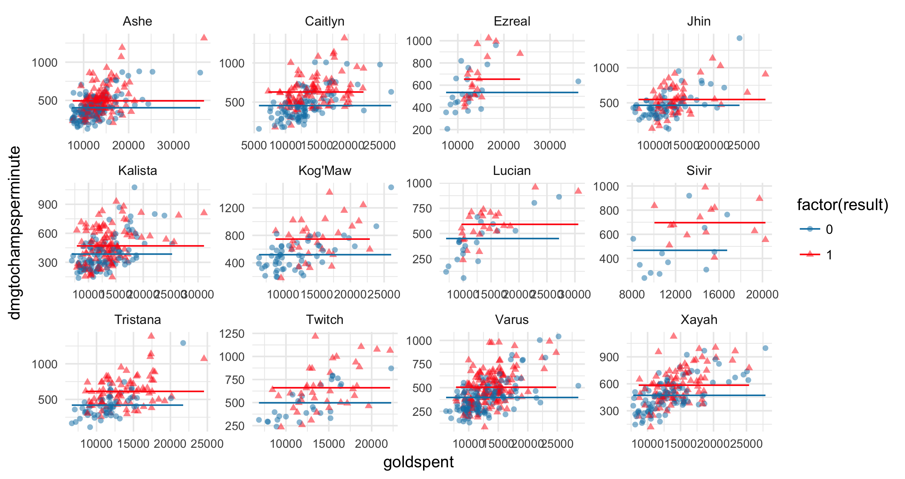
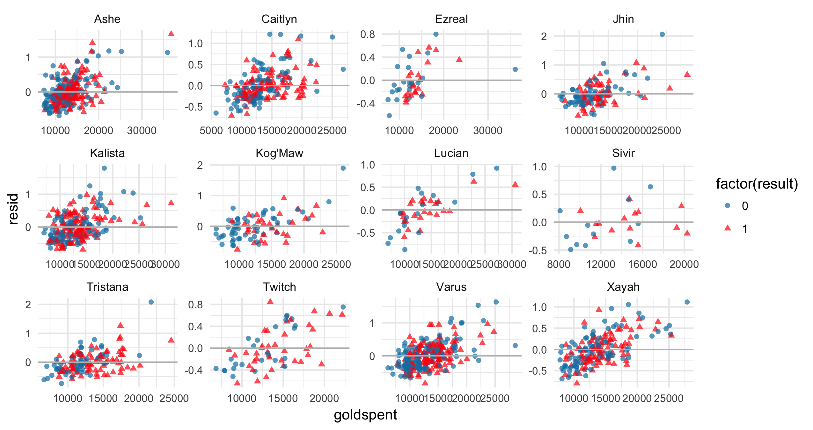
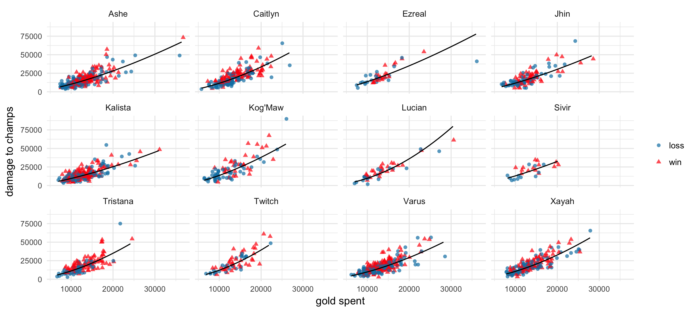
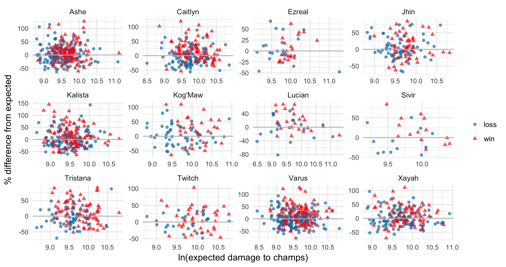
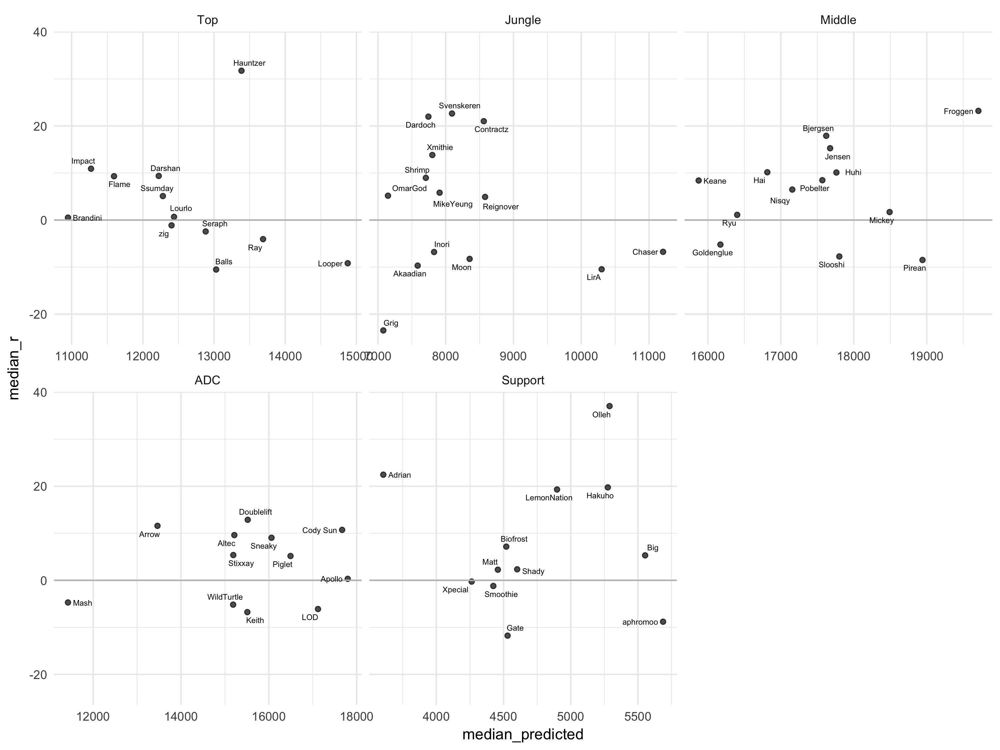
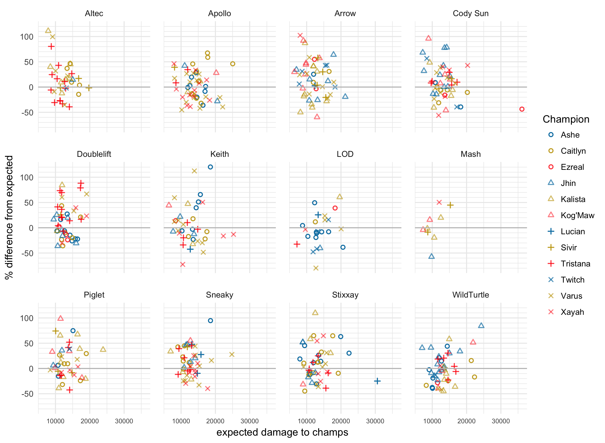

# Measuring skill in outputting damage

In August of 2017, [Riot released a new statistic called "damage rating"](http://www.lolesports.com/en_US/articles/introducing-damage-rating-better-metric-track-damage). This new statistic is based off of the old statistic, `damage to champs per minute`, adjusted for champion, game result, and time spent around enemies. They note that one of the weaknesses of the statistic is that it is not adjusted for game length. 

There are a few areas where I think Riot's damage rating falls short. 

- Purely from an interpretation standpoint, if you break it down, the stat stands for `damage to champs per minute per time spent around enemy champions`, which is clunky and hard to understand if it means anything. There doesn't seem to be much point in dividing by game length and then again dividing by time spent around enemy champions. A cleaner, simpler stat would be `damage to champs per time spent around enemy champions`

- I'm skeptical of using `game result` as a predictor in a stat that is meant to measure skill. To those unfamiliar with stats, this statistic is created by modeling what "expected damage to champions" is under certain conditions. In a good model, you include variables that you think *cause* the model's output--i.e. playing Ashe *causes* damage output to be higher than playing Braum. It's very iffy to say that winning a game *causes* higher damage output--it's like watching a teamfight start, then looking into the future and saying "Team A wins later, so the fact that they win later is going to make Team A's carries do more damage in this teamfight". 

  I'm doubly skeptical because what we are trying to measure is skill. Skill in outputting damage is one of the factors that contributes to a game win--by accounting for `game result` we are effectively cancelling out a portion of that skill. 

  You may argue that the snowball effect means that, given equal skill at outputting damage, as long as one team is ahead, the player who is ahead is going to do much more damage. That's probably true--which means, instead of `game result`, we should look for a variable that captures the snowball effect. But it shouldn't be `game result`. `game result` wraps up *everything* that happens in a game--kills, objectives taken, gold earned. It's too high-level and too coarse of an approximation to be useful (see Fig below) because it collapses everything into a binary result: 1 if you win, 0 if you lose. 

- Riot notes that one of the weakneses of their stat is that it does not account for game length. However, I believe damage varies with `gold spent`, not with `game length`--and I believe that if you account for `gold spent`, you account for much of the snowball effect and thus much of the differences that Riot used `game result` to account for. 

My issues with damage rating are much easier to understood in pictures than in words. The graph below gives, for all champions played in the ADC role, their `damage to champs per minute` against `gold spent` in each game:

The points are red triangles if they won that game and blue circles if they lost. The red horizontal line in each graph represents the `expected damage to champs per minute` for that champion in a win, using Riot's method (but not adjusted for time around enemy champions, since that is not provided). The blue horizontal line is Riot's `expected damage to champs per minute` for that champion in a loss. Riot ultimately calculates their damage rating by subtracting the expected damage from the actual damage, and calculating the percent difference.

Automatically we can see clusters of red and blue--damage is indeed higher when a champion wins. But note also that as the amount of gold you get in a game increases, the damage increases as well. A good statistic should account for this trend as well.

Ideally, if we were to calculate Riot's damage rating (in stat speak we can call their damage rating the relative residuals from expected damage output), we should see no difference in the distribution of damage ratings when `gold spent` is low vs when `gold spent` is high. 

But that is clearly not the case. What this graph is telling us is that Riot's damage rating overestimates expected damage when `gold spent` is low, and underestimates expected damage when `gold spent` is high. 

**But doesn't earning gold also involve skill?** Yes. But if you were to freeze a moment in time, and you had to predict how much damage someone would do in a teamfight that's coming up *right now*, what would you look at first? The natural answer is their items, and the opposing team's items. At that point, what happens earlier in the game doesn't matter--only the current state of the game. Gold is an approximation of the items the champion has. If Riot released full data for gold spent and damage at every time point in a game, then we would be able to predict damage at *any* instant of a game, given the gold at that time point, perhaps using a functional data approach. Then the skill involved in gaining that gold is naturally excluded from the model, because at each time point you only consider how much gold you have at that time. For this reason, I chose to use `gold spent`.

Alternatively, instead of using `gold spent` you can use `game length`. But `gold spent` is more informative--after accounting for `gold spent`, `game length` is not significant, while the reverse is not true.

## An Alternative Model

A simpler, cleaner, more automatically interpretable model would be to calculate expected damage output as a function of `champion`, `position`, and `gold spent`. (I include `position` because some champions are played in multiple positions and can function differently in those different positions.) 

Each champion played in each position will have a different "expected damage graph" based on `gold spent`. This is illustrated in the picture below.

For each champion, the curve is adjusted slightly to best match that champion's data. 

In this case, the solid black line is the expected `damage to champs` using this alternative model. Note that the blue dots and red dots are spread roughly evenly above and below the line. This is more clearly seen if we, essentially, subtract the expected damage to champs line to get just the alternative damage rating across the predicted damage output values.

(The x-axis values don't match up because the model was fit to `ln` values.)

The key thing to note here is that the blue and red points tend to range equally above and below the x-axis. Of course there is still a clear difference between the blue and red points--more red points for higher expected damage values, corresponding to a winning team tending to get more gold. 

Another useful thing about these graphs is that we can see for which champions the model does not fit well (that is, some kind of trend is still present after calculating the residuals (damage rating)). The remainder of the graphs are in `Output/LPRE/Diagnostics/residual_graph_[position name].png`. 

**Technical note**: Instead of using least squares error, as is typical in regression, I used the *least product relative estimator* (LPRE). The goal of this is to create an estimator that takes into account percent difference, rather than squared error. The reason for this is that when I earlier used least squares error, the points with extremely high `gold spent` had enormous leverage, whereas the mass of points with low `gold spent` had much lower leverage, causing the line of fit to skew to fit 1 point corresponding to high `gold spent`. Since what matters to us is percent difference, not actual distance, this is completely incorrect. 

Code to calculate the LPRE was kindly provided by Professor Zhanfeng Wang and Professors Chen et. al.

Chen, Kani, et al. "Least product relative error estimation." *Journal of Multivariate Analysis* 144 (2016): 91-98.

All output from the LPRE estimator model is in the folder `Output/LPRE`.

## Rankings

Of course, what is the point of all of this if we don't produce rankings? The graph below gives the median damage rating vs median expected damage for all players in the NA LCS, by position.

In my experience playing with this model and various others that I tried, is that values are very sensitive to model fit. Thus I used median instead of average. I also encourage anyone who's reading this to not put too much stock into the *order* itself (yes, I know it's a ranking, but still) and instead to look at clusters. For example, in the jungle, Svenskeren, Dardoch, and Contractz can be seen as one cluster--insead of separating into 1. Svenskeren, 2. Dardoch, and 3. Contractz, it's more valuable to note that they're very close to one another and thus form the top-performing cluster. No model is perfect, so when the estimates are close, it is better to not put too much stock into their differences.

(A more robust way of presenting this would be to calculate some form of standard error, which I leave for future work. :smiley:)

The remainder of the graphs are in `Output/LPRE/Rankings/[league name]graph_byposition.png`. 

But the median isn't all we would be interested in, is it? We would also like to know which champions the players tend to play, how often, and how well they perform on them.

From here we can compare players' champion pools and their respective performances. For example, Doublelift seems to be the best Tristana player, Altec had a standout game on Kalista, and Keith should maybe stick to Ashe and stay away from Varus/Xayah.

More graphs like this can be found in `Output/LPRE/Rankings/[league name]_breakdown_[position name].png`. 

If you've read through this, then thanks! Comments and critique are welcome. :)

