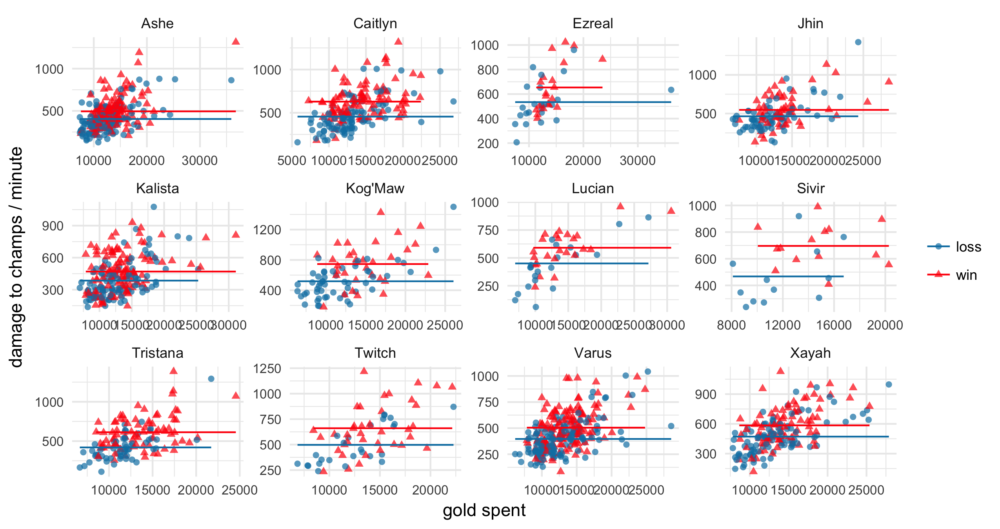
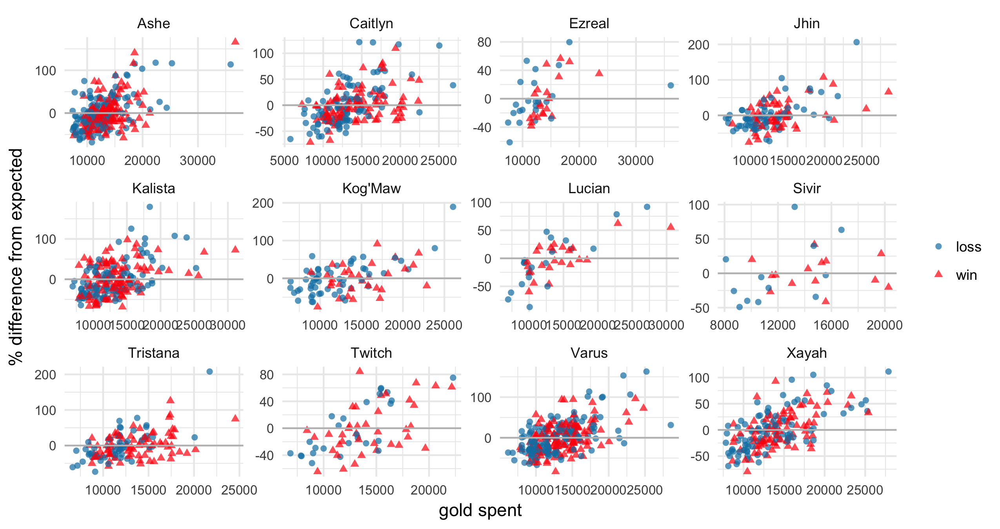

# Measuring skill at outputting damage

In August of 2017, [Riot released a new statistic called "damage rating"](http://www.lolesports.com/en_US/articles/introducing-damage-rating-better-metric-track-damage). It's based off of the old statistic, `damage to champs per minute`, which is then divided by `time spent around enemies`. For each champion, two averages are calculated: average `damage to champs per minute` / `time spent around enemies` in wins and in losses. These averages form the `expected damage` based on champion and game result. You then calculate a player's damage rating in a game by calculating the percent difference between his damage output on the champion he played and the expected value. They note that one of the weaknesses of the statistic is that it is not adjusted for game length. 

Of course, no model or statistic is ever going to be perfect, but there are a few easy steps to take that I think would improve Riot's damage rating.

- If you break down what the stat means, it stands for `damage to champs per minute per time spent around enemy champions`, which is clunky and hard to understand if it means anything. There doesn't seem to be much point in dividing by game length and then again dividing by time spent around enemy champions. A cleaner, simpler stat would be `damage to champs per time spent around enemy champions`

- I'm skeptical of using `game result` as a predictor in a stat that is meant to measure skill. To those unfamiliar with stats, Riot's new statistic is based on modeling what the expected damage is and, in a good model, you include variables that you think *cause* the model's output---i.e. playing Ashe *causes* damage output to be higher than playing Braum. It's very iffy to say that winning a game *causes* higher damage output---it's like watching a teamfight start, then looking into the future and saying "Team A wins later, so the fact that they win later is going to make Team A's carries do more damage in this teamfight". 

  I'm doubly skeptical because what we are trying to measure is skill. Skill in outputting damage is one of the factors that contributes to a game win---by accounting for `game result` we are effectively cancelling out a portion of that skill. 

  You may argue that the snowball effect means that, given equal skill at outputting damage, as long as one team is ahead, the player who is ahead is going to do much more damage. That's probably true---which means we should look for a variable that captures the snowball effect. But it shouldn't be `game result`. `game result` wraps up *everything* that happens in a game---kills, objectives taken, gold earned. It's too high-level and too coarse of an approximation to be useful (see the two graphs below) because it collapses everything into a binary result: 1 if you win, 0 if you lose. 

- Riot notes that one of the weakneses of their stat is that it does not account for game length. However, I believe damage varies with `gold spent`, not with `game length`---and I believe that if you account for `gold spent`, you account for much of the snowball effect and thus much of the differences that Riot used `game result` to account for. 

My issues with the current damage rating are much easier to understood in pictures than in words. The graph below gives, for all champions played in the ADC role, their `damage to champs per minute` against `gold spent` in each game:

**Fig 1.** Damage to champs per minute vs gold spent

The points are red triangles if they won that game and blue circles if they lost. The red horizontal line in each graph represents the `expected damage to champs per minute` for that champion in a win, using Riot's method (but not adjusted for time around enemy champions, since that is not provided). The blue horizontal line is Riot's `expected damage to champs per minute` for that champion in a loss.

Automatically we can see clusters of red and blue---damage is indeed higher when a champion wins. But note also that as the amount of gold you get in a game increases, the damage increases as well---this means that the current damage rating overestimates expected damage when `gold spent` is low, and underestimates expected damage when `gold spent` is high. 

This is made clearer by a graph of the residuals vs fitted values. The residuals, in this case, are percent residuals and represent Riot's damage rating. The fitted values are expected damage. Ideally, we should see no difference in the distribution of the residuals (damage ratings) when `gold spent` is low vs when `gold spent` is high. But that is clearly not the case. 

**Fig 2.** Riot's damage rating vs gold spent

**But doesn't earning gold also involve skill?** Yes. But if you were to freeze a moment in time, and you had to predict how much damage someone would do in a teamfight that's coming up *right now*, what would you look at first? The natural answer is their items, and the opposing team's items. At that point, what happens earlier in the game doesn't matter, only the current state of the game does. Gold works as an approximation of the items the champion has. If Riot released full data for gold spent and damage at every time point in a game, then we would be able to predict damage at *any* instant of a game, given the gold at that time point, perhaps using a functional data approach. Then the skill involved in gaining that gold is naturally excluded from the model, because at each time point you only consider how much gold you have at that time. For this reason, I chose to use `gold spent`.

Alternatively, instead of using `gold spent` you can use `game length`. But `gold spent` is more informative---after accounting for `gold spent`, `game length` is not significant, while the reverse is not true.

## An Alternative Model

A simpler, cleaner, more automatically interpretable model would be to calculate expected damage output as a function of `champion`, `position`, and `gold spent`. (I include `position` because some champions are played in multiple positions and can function differently in those different positions.) 

Each champion played in each position will have a different "expected damage graph" based on `gold spent`. This is illustrated in the picture below.

**Fig. 3** Damage to champs vs gold prediction, overlaid with expected damage

For each champion, the curve is adjusted slightly to best match that champion's data. 

In this case, the solid black line is the expected `damage to champs` using this alternative model. Note that the blue dots and red dots are spread roughly evenly above and below the line. This is more clearly seen if we, essentially, subtract the expected damage to champs line to get just the alternative damage rating across the predicted damage output values.

**Fig. 4** Relative residuals vs fitted values

The key thing to note here is that the blue and red points tend to range equally above and below the x-axis. Of course there is still a clear difference between the blue and red points--more red points for higher expected damage values, corresponding to a winning team tending to get more gold. 

Another useful thing about these graphs is that we can see which champions the model doesn't fit well (that is, some kind of trend is still present after calculating the residuals (damage rating)). The remainder of the graphs are in `Output/LPRE/Diagnostics/residual_graph_[position name].png`. 

**Technical note**: Instead of using ordinary least squares (OLS) error, as is typical in regression, I used the *least product relative estimator* (LPRE). The goal of this is to create an estimator that takes into account percent difference, rather than squared error. I first started with models that used (OLS), but the points with extremely high `gold spent` had enormous leverage, whereas the mass of points with low `gold spent` had much lower leverage. This caused the line of fit to skew to fit 1 extremely high damage point corresponding to high `gold spent`. Since what matters to us is percent difference, not actual distance, this was completely incorrect. 

Code to calculate the LPRE was kindly provided by Professor Zhanfeng Wang and Professors Chen et. al.

Chen, Kani, et al. "Least product relative error estimation." *Journal of Multivariate Analysis* 144 (2016): 91-98.

All output from the LPRE estimator model is in the folder `Output/LPRE`.

**Is there still a difference in damage based on game result?** Actually, yes. But the difference is much smaller than before.

With the LPRE, the model can be approximated by `dmgtochamps` = exp(`position`\*`gold spent` + `champion`\*`gold spent` + error). 

If we add in `game result` to this model, we end up with `dmgtochamps` = exp(`position`\*`gold spent` + `champion`\*`gold spent` + error)*exp(`game result`). After accounting for gold spent, position, and champion, exp(`game result`) = 1.08, meaning champions output on average 8% more damage in wins than losses.

If we adjust the model so it no longer accounts for `gold spent` (equivalent to the current damage rating), exp(result) = 1.24, meaning champions output on average 24% more damage in wins and losses when `gold spent` is not included in the model. This is a massive decrease and serves to support my point that `game result` is a coarse, high-level stat that contains in it information about a lot of other stats, such as `gold spent` (gold being higher in wins than losses). 

**Where is the remaining 8% of damage coming from?** This question is central to why I am not including `result` in the model. Is this due to better team play in setting up advantages for their players to deal damage? Is it actually just due to players who are better at outputting damage causing them to win more often? Or is it all part of the snowball effect? The difference is small enough that I feel comfortable leaving it out at this time. The goal of this statistic is *not* to eliminate all factors that change damage output, but to account for those factors that don't involve player skill. 

My suspicion is that the 8% difference in wins vs losses would be further reduced by a model that calculates `damage` as a function of `gold spent` at any instant in time, instead of using aggregate values at the end of the game.

## Rankings

Of course, what is the point of all of this if we don't produce rankings? The graph below gives the median damage rating vs median expected damage for all players in the NA LCS, by position.

**Fig. 5** NA LCS damage ratings across positions

In my experience playing with this model and various others that I tried, is that values are very sensitive to model fit. Thus I used median instead of average. I also encourage anyone who's reading this to not put too much stock in the *order* itself (yes, I know it's a ranking, but still) and instead to look at clusters. For example, in the jungle, Svenskeren, Dardoch, and Contractz can be seen as one cluster--insead of separating into 1. Svenskeren, 2. Dardoch, and 3. Contractz, it's more valuable to note that they're very close to one another and thus form the top-performing cluster. No model is perfect, so when the estimates are close, it is better to not put too much stock into their differences.

(A more robust way of presenting this would be to calculate some form of standard error, which I leave for future work. :smiley:)

The remainder of the graphs are in `Output/LPRE/Rankings/[league name]_dmgvsregid_graph.png`. 

**If anything, these rankings should be seen as a sanity check of the model**---are they reasonable? Are any surprising differences from your expectation easily explainable? In League, the ultimate test still isn't statistics, but the eye test. 

That being said, the median isn't all that interesting, is it? We would also like to know which champions the players tend to play, how often, and how well they perform on them.

**Fig. 6** NA LCS ADC damage breakdown by champion

From here we can compare players' champion pools and their respective performances. For example, Doublelift seems to be the best Tristana player, Altec had a standout game on Kalista, and Keith should maybe stick to Ashe and stay away from Varus/Xayah.

More graphs like this can be found in `Output/LPRE/Rankings/[league name]_breakdown_[position name].png`. 

## Extensions

- As stated before, one extension would be to calculated expected damage *in real-time* using a functional data analysis approach.

- Another would be to account for team members' damage output. You may expect players whose teammates are doing well to then benefit from their performance.

If you've read through this, then thanks! Comments and critique are welcome. :)
