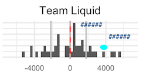

# Lead vs Deficit: Numbers with Context

While watching TSM v Phoenix1 at the end of the Summer 2017 regular season, I noticed something odd about Riot's broadcast: a little graphic that popped up, giving TSM's average gold lead at 20 minutes and comparing it to their current gold difference. 

**Fig 1.** TSM gold difference comparison

"Wow, that's a huge lead they have this game" is what you'd think after seeing this. 423 is a pittance compared to 5,341. But I'd watched all of TSM's games (and obsessively checked the gold difference throughout the games to reassure myself they were doing well)--and an average gold *lead* of 423 seemed really, well, small compared to how well I know they play. 

Then I realized that Riot was averaging over gold *difference*, not gold *lead*. Which I argue is not the metric you want to use if you're trying to answer the viewer's question, "Is this a huge lead or not?"

## Is this a huge lead or not?

The operative word in the question above is "lead." The pure average for gold difference isn't helpful in this case--it doesn't give a team's average lead, but its average performance. And given the snowball effect present in League, at 15 or 20 minutes, a team's performance is often bimodal--either they are doing well, or they are behind. It is rare for a team to be roughly even with the opposition. The histograms of gold difference below show this more clearly.

**Fig 2.** NA LCS gold difference histogram

(Histograms like this for most leagues available in the `Output` folder. LPL not included because the data isn't available through Oracle's Elixir.)

The red lines are 0, when a team is exactly even with the opposing team. The dashed line is the pure average gold difference at 15 minutes (instead of 20, because 15 minutes all I could find). The solid lines are the average deficit and average lead for a team. Notice that for every team, the pure average falls into a "dead zone" where few of the team's games actually lie--this is the snowball effect at work, creating for many teams a bimodal distribution centered at 0. Thus the pure average isn't as informative as you would think.

The pure average is useful for telling how well a team does on average--are they ahead or are they behind? But even then it is not as descriptive as it could be. For example, TSM's average is slightly positive at 15 minutes--but this isn't because they are more often ahead. In the 2017 Summer Split, TSM was ahead in 18 of their games and behind in 23 of them. What skews their average to be even or slightly positive is the few games where they had an astonishingly large gold lead, combined with how modest thier deficits tend to be. In contrast, Team EnvyUs's average is positive because of the number of games they are ahead (their average lead and average deficit are close in absolute size to each other).

**Proposal** When using numbers to describe something, the distribution is almost always more helpful. Perhaps it's a statistician's silly pipe dream, but it seems like it would be just as easy to communicate and more informative/interesting if, instead of a text graphic, a small histogram like the ones I've given here was showed instead, with an additional point added for the lead that game, a la Edward Tufte's [sparkcharts](http://www.fusioncharts.com/chart-primers/spark-charts/). Numbers can be discreetly added to give the average gold lead/deficit, and the lead for that game. It both gives you a sense of *how often* a team is ahead vs behind, and *how large* their current lead is compared to the average. 

## How much does a lead contribute to game win?

A fun past-time for me is making graphs. (Yes, that is the nerdiest thing ever.) And, given how competitive games feel compared to earlier seasons, when it seems like even teams that are a few thousand gold behind early on can make a comeback, I was curious to see how well a gold lead at 15 minutes translates to a game win. 

The plot below gives, across various leagues, the \% of games won for each team when ahead at 15 minutes (y-axis) vs the \% of games won when behind at 15 minutes (x-axis).

**Fig 3.** Comparison of how many games teams win when ahead vs behind
 

There's a lot going on in here, but the key takeaway from this graph is actually pretty simple:

- Upper left quadrant: You tend to win (>50\%) when you're ahead, and lose when you're behind.

- Lower left quadrant: You tend to lose when you're ahead or behind.

- Upper right quadrant: You tend to win, ahead or behind.

- Lower right quadrant: You tend to lose when you're ahead and win when you're behind. (Naturally, no team ever falls into this quadrant.)

The rest of what's on the graph is for context. The points are labeled with the team names so you can see which teams are doing well. Before the team name, in parentheses, is the team's rank in terms of games won (rather than matches, just because this was easier, and individual games won seems like the more relevant unit in this case anyway). This is so you can compare their position in the graph with their rank--you would expect higher ranked teams to be closer to the upper right quadrant. After the team name is the number of games the team was ahead at 15 minutes, labeled with an up arrow, and the number of games the team was behind, labeled with a down arrow. This is so you can understand more of the team's tendencies (TSM tends to be behind often and wins anyway), and also see if they've played enough games ahead or behind to actually be able to judge their win % when ahead or behind. In the EU LCS, for example, Fnatic has a high win percentage when behind--but they were only behind in 5 games. 

Some interesting things can be noted from the graph. The EU LCS, for example, seems to have a larger variance in skill, since the 1st, 2nd, and 4th teams in terms of game % all tend to win whether ahead or behind. The LCK, in contrast, is almost entirely contained in the upper left quadrant--these teams are much closer together in skill. 

One note is that I would hesitate to compare across leagues. The LCK's distribution doesn't in itself mean that leagues with better teams would all be in the upper left quadrant--what it means is the teams are close in skill, and if a team falls behind, it's likely they will lose. It's tempting to say that this is because LCK teams are great at closing out leads--and that's actually likely true. But the *graph* itself does not support that, because it could also mean that no LCK team has figured out how to come back from behind against other LCK teams. A common mistake I see people make is try to use *variance* of skill to predict the average *level* of skill. They say, "this league is really competitive (low variance) so they must be more skilled (high average level)" when, typically, those aren't related at all. While this argument can be convincing when comparing one league to itself ("the NA LCS is more competitive now, forcing the teams to better than before"), this argument doesn't hold any water when comparing across leagues ("the NA LCS teams are closer together than the EU LCS teams, meaning the NA LCS is stronger right now"). The NA LCS teams may all be competitive with *each other*...and below all of the EU LCS teams at the same time.

This graph begs the question--are the higher ranked teams able to close out leads because they have larger leads, on average? The teams that are able to come back from behind, is it because their deficits tend to be small? The plot below sets each league's win/loss \% graph next to a graph that compares their average deficit size with the average lead size.

**Fig 4.** Win % compared to deficit/lead size

The takeaway from this new set of graphs is:

- If a team lies above the diagonal line, their average lead is larger than their average deficit.

- If a team is light blue, they have a high game win percentage.

- The higher along the diagonal line a team is, the more "swingy" a team's early game tends to be--they average deficit and average lead are both high.

You would expect light blue dots to be above the diagonal line, with dark blue dots below the line. Some interesting teams are BBQ Olivers in the LCK, which is well above the diagonal but is 9th place in terms of game wins, which indicates that, when they get a lead, it tends to be large, but they can't hold on to it. In the NA LCS, the 1st place team, TSM, has a very conservative early game--they lie very low on the diagonal, meaning their early games don't swing as much. This helps explain how they tend to win whether early or behind--they simply don't depend as much on the early game as other teams. (Probably not surprising to many fans, who know that TSM's strengths lie later in the game.) This is in stark contrast to the 2nd place team, Immortals, who have the largest average early game lead and the second smallest early game deficit. 